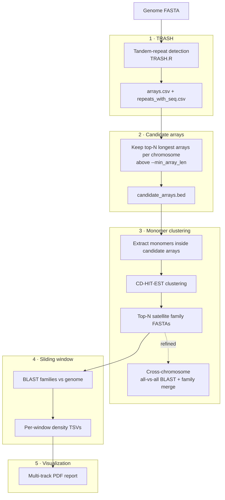
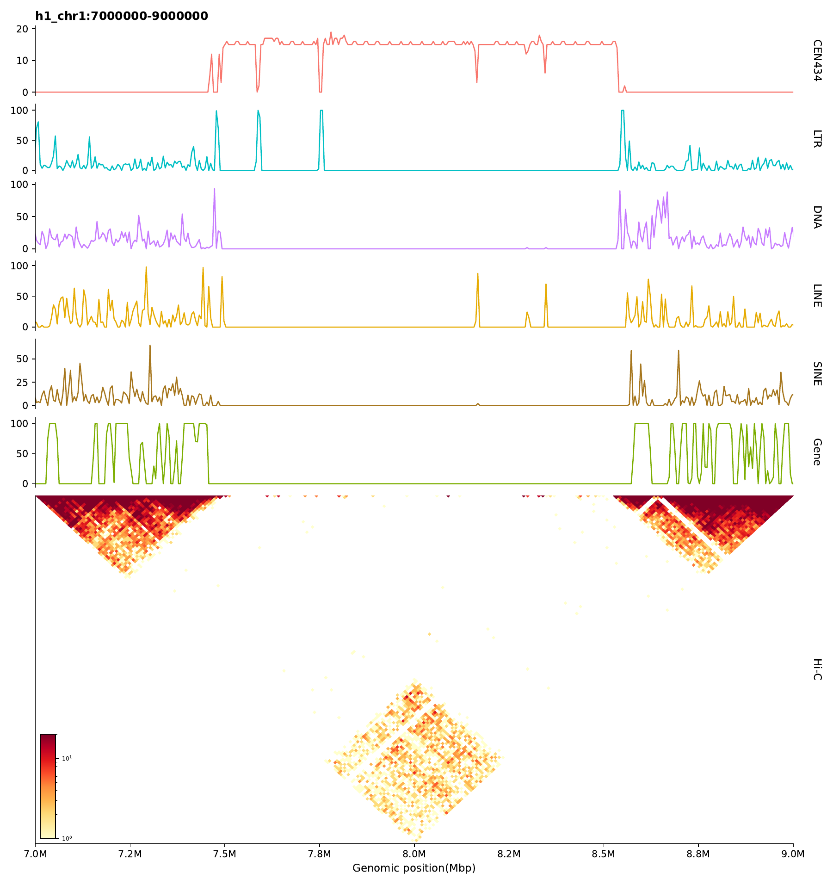

# AutoCen

**Automated centromere satellite identification and multi‑omics visualization for chromosome‑level genome assemblies.**

[](LICENSE)
[](https://doi.org/10.5281/zenodo.21475672)
[](#)
[](#)

AutoCen takes a genome assembly and automatically (1) finds tandem‑repeat arrays with
[TRASH](https://github.com/vlothec/TRASH_2), (2) extracts and clusters their monomers into
candidate centromeric satellite families, (3) maps each family back to the genome to build
per‑window density profiles, and (4) renders publication‑ready figures. A separate `plot`
mode overlays those satellite tracks with transposable‑element, gene, and Hi‑C tracks so you
can inspect centromere architecture in a single multi‑omics view.

---

## Table of contents

- [Overview](#overview)
- [Pipeline](#pipeline)
- [Example output](#example-output)
- [Installation](#installation)
- [Dependencies](#dependencies)
- [Usage](#usage)
  - [`scan_te` — profile TE composition](#scan_te--profile-te-composition)
  - [`centromere` — identify satellite families](#centromere--identify-satellite-families)
  - [`plot` — multi‑omics visualization](#plot--multi-omics-visualization)
- [Output structure](#output-structure)
- [Worked example](#worked-example)
- [Citation](#citation)
- [License](#license)
- [Acknowledgements](#acknowledgements)

---

## Overview

AutoCen is a single command‑line program (`AutoCen.py`) with three subcommands:

| Subcommand | Purpose |
|---|---|
| `scan_te` | Summarize the TE composition of a genome from a RepeatMasker `.out` file. Prints each repeat class/family with its copy number and genome percentage — use the exact names it reports to build `--te_mapping` for the `plot` step. |
| `centromere` | The core pipeline: run TRASH, select the longest tandem‑repeat array(s) per chromosome, extract and cluster their monomers into satellite families, compute per‑window density, and produce a PDF report. |
| `plot` | Build a fully customizable multi‑track figure from one or more monomer FASTA files, optionally adding TE‑density, gene‑density, and Hi‑C tracks over specific chromosomes or regions. |

### Two clustering modes for `centromere`

- **Standard mode** (default) — all monomers from every chromosome are pooled and clustered
  together, giving a single global set of satellite families. Best when one satellite family
  dominates the centromeres genome‑wide.
- **Refined mode** (`--refined`) — monomers are clustered **independently per chromosome**,
  then an all‑vs‑all comparison merges equivalent families across chromosomes
  (complete‑linkage, symmetric coverage filter). Best when different chromosomes may carry
  distinct satellite families. Adds a cross‑chromosome identity matrix, a merged‑family set,
  and an annotated heatmap to the report.

---

## Pipeline



---

## Example output



*A single `plot` command over a 2‑Mb window (`chr1:7–9 Mb`) of a chromosome‑level fish genome
assembly. Top to bottom: density of an AutoCen‑identified satellite monomer family (**CEN434**);
four transposable‑element classes grouped with `--te_mapping` (**LTR**, **DNA**, **LINE**,
**SINE**); **gene** density from a GFF3; and a **Hi‑C** contact heatmap. The satellite family
forms a ~1.1‑Mb plateau (≈7.45–8.55 Mb) that coincides with a sharp gene desert and a Hi‑C
contact boundary, while the TE classes are enriched in the flanking arms — the classic
architecture of a centromere, assembled into one view.*

---

## Installation

### 1. Clone the repository

```bash
git clone https://github.com/Xiang-Yunpeng/AutoCen.git
cd AutoCen
```

### 2. Create the conda environment

All Python and third‑party command‑line tools are declared in `autocen_conda.yml`:

```bash
conda env create -f autocen_conda.yml
conda activate autocen
```

### 3. Install TRASH (required for the `centromere` step)

`centromere` calls [TRASH](https://github.com/vlothec/TRASH_2) to detect tandem‑repeat arrays.
Clone it anywhere and note the path to `TRASH.R`:

```bash
git clone https://github.com/vlothec/TRASH_2
# The script you pass to --trash_path is: TRASH_2/src/TRASH.R
```

> If you already have TRASH output for your genome, you can skip running TRASH and point AutoCen
> at the existing results with `--trash_dir` instead of `--trash_path`.

### 4. Install the bundled R packages (offline, for TRASH under R 4.4)

TRASH depends on several Bioconductor packages. To make installation reproducible on machines
with limited internet access, the exact source tarballs are bundled in `packages/`. Install
them **in this order** (dependencies first) from within the `autocen` environment:

```r
# 1. Base packages (no dependencies)
install.packages("packages/zlibbioc_1.52.0.tar.gz",         repos = NULL, type = "source")
install.packages("packages/BiocGenerics_0.52.0.tar.gz",     repos = NULL, type = "source")
install.packages("packages/GenomeInfoDbData_1.2.15.tar.gz", repos = NULL, type = "source")

# 2. Vector / range packages
install.packages("packages/S4Vectors_0.44.0.tar.gz",        repos = NULL, type = "source")
install.packages("packages/IRanges_2.40.1.tar.gz",          repos = NULL, type = "source")

# 3. Extension packages (UCSC.utils is required for R 4.4 compatibility)
install.packages("packages/XVector_0.46.0.tar.gz",          repos = NULL, type = "source")
install.packages("packages/UCSC.utils_1.2.0.tar.gz",        repos = NULL, type = "source")

# 4. Genome information + core sequence packages
install.packages("packages/GenomeInfoDb_1.42.3.tar.gz",     repos = NULL, type = "source")
install.packages("packages/Biostrings_2.74.1.tar.gz",       repos = NULL, type = "source")
```

> These tarballs are unmodified Bioconductor releases redistributed under their Artistic‑2.0
> licenses — see [`NOTICE`](NOTICE). If you have a working internet connection you may instead
> install them with `BiocManager::install(...)` and skip this step.

### 5. Verify

```bash
python AutoCen.py --version      # AutoCen v1.0.0
python AutoCen.py --help
```

---

## Dependencies

Everything below is provided by `autocen_conda.yml`; the table is for reference.

| Tool | Used by | Purpose |
|---|---|---|
| Python ≥ 3.13 (pandas, numpy, matplotlib) | all | Pipeline driver and plotting |
| [`hicstraw`](https://pypi.org/project/hic-straw/) | `plot --hic` | Reading `.hic` contact matrices (optional; only needed for the Hi‑C track) |
| R ≥ 4.4 + TRASH | `centromere` (full‑automation mode) | Tandem‑repeat array detection |
| CD‑HIT (`cd-hit-est`) | `centromere` | Monomer clustering |
| BLAST+ (`blastn`, `makeblastdb`) | `centromere`, `plot` | Mapping monomers back to the genome |
| BEDTools (`bedtools`) | `centromere`, `plot` | Window generation and density counting |
| SAMtools (`samtools`) | `centromere`, `plot` | Genome indexing (`.fai`) |

AutoCen checks for `cd-hit-est`, `blastn`, `bedtools`, and `samtools` on startup and exits with a
clear message if any is missing.

---

## Usage

```bash
python AutoCen.py {scan_te, centromere, plot} [options]
```

### `scan_te` — profile TE composition

Parses a RepeatMasker `.out` file and prints every repeat class/family with its copy number,
total length, and percentage of the genome. Use the reported names verbatim in `--te_mapping`
when building TE tracks in `plot`.

```bash
python AutoCen.py scan_te -o genome.fasta.out -f genome.fasta.fai
```

| Argument | Required | Description |
|---|---|---|
| `-o`, `--rm_out` | yes | RepeatMasker `.out` file |
| `-f`, `--fai` | yes | Genome `.fai` index (from `samtools faidx`) |

### `centromere` — identify satellite families

```bash
python AutoCen.py centromere \
    --genome genome.fasta \
    --work_dir ./autocen_out \
    --trash_path /path/to/TRASH_2/src/TRASH.R \
    --chrom_num 24 \
    --threads 20
```

Add `--refined` to cluster per chromosome and run the cross‑chromosome comparison.

**Input & TRASH**

| Argument | Default | Description |
|---|---|---|
| `--genome` | *required* | Input genome FASTA |
| `--work_dir` | *required* | Output directory (created if missing) |
| `--trash_path` | – | Path to `TRASH.R` (**full‑automation mode**: AutoCen runs TRASH for you) |
| `--trash_dir` | – | Path to an **existing** TRASH output directory (skip running TRASH) |
| `--threads` | `20` | CPU threads |
| `--chrom_num` | all | Only analyze the first *N* sequences of the FASTA (chromosomes are typically listed before unplaced contigs/scaffolds) |
| `--refined` | off | Enable refined (per‑chromosome + cross‑chromosome) mode |

**Array & monomer selection**

| Argument | Default | Description |
|---|---|---|
| `--top_arrays` | `1` | Keep the top‑*N* longest arrays per chromosome |
| `--min_array_len` | `50000` | Minimum array length (bp) |
| `--top_monomers` | `3` | Number of satellite families (largest CD‑HIT clusters) to output |
| `--min_monomer_len` | `50` | Drop monomers shorter than this (bp) before clustering |
| `--min_cluster_size` | `5` | Discard CD‑HIT clusters with fewer members |
| `--min_monomer` | `10` | *(refined only)* Skip chromosomes with fewer than this many monomers |

**Clustering & alignment**

| Argument | Default | Description |
|---|---|---|
| `--cdhit_id` | `0.8` | CD‑HIT identity threshold (`-c`); word length `-n` is set automatically |
| `--cdhit_aS` | `0.0` | CD‑HIT alignment coverage for the shorter sequence |
| `--cdhit_aL` | `0.0` | CD‑HIT alignment coverage for the longer sequence |
| `--window` | `10000` | Sliding‑window size (bp) for density |
| `--blast_task` | `megablast` | BLAST task (`megablast` / `blastn` / `dc-megablast`) |
| `--blast_identity` | `80.0` | Minimum percent identity for hits |
| `--blast_qcov` | `0` | Minimum query coverage per HSP (`-qcov_hsp_perc`) |
| `--blast_evalue` | `1e-10` | BLAST e‑value threshold |
| `--cross_qcov` | `80.0` | *(refined only)* Minimum bidirectional coverage for calling two families the same across chromosomes |

### `plot` — multi‑omics visualization

Build a custom multi‑track figure from one or more monomer FASTA files (for example the family
FASTAs produced by `centromere`), optionally layering TE, gene, and Hi‑C tracks.

```bash
python AutoCen.py plot \
    --genome genome.fasta \
    --work_dir ./plot_out \
    --monomers CEN1:family1.fasta CEN2:family2.fasta \
    --region chr1:16M-18M \
    --rm_out genome.fasta.out \
    --te_mapping "LTR/Gypsy:Gypsy" "LINE/Rex:Rex-Babar,LINE/L2" \
    --gff annotation.gff3 \
    --hic contacts.hic --hic_res 250000
```

| Argument | Default | Description |
|---|---|---|
| `--genome` | *required* | Input genome FASTA |
| `--work_dir` | *required* | Output directory |
| `--monomers` | *required* | One or more monomer FASTAs. Optional track label via `Label:file.fasta` |
| `--region` | – | Regions to plot, e.g. `chr1,chr2` or `chr1:16M-18M`. Overrides `--chrom_num` |
| `--chrom_num` | all | Plot the first *N* sequences when `--region` is not given |
| `--window` | `10000` | Sliding‑window size (bp) |
| `--threads` | `20` | CPU threads |
| `--fig_width` | `10.0` | Figure width (inches) |
| `--track_height` | `1.8` | Height of each standard track (inches) |
| `--blast_task` / `--blast_identity` / `--blast_qcov` / `--blast_evalue` | `megablast` / `80.0` / `0` / `1e-10` | Monomer‑vs‑genome BLAST settings (as above) |
| `--rm_out` | – | RepeatMasker `.out` for a TE‑density track |
| `--te_mapping` | – | TE grouping rules: `TrackName:TE1,TE2` (one track per argument) |
| `--gff` | – | GFF3 file for a gene‑density track (uses `gene` features) |
| `--hic` | – | `.hic` file for a Hi‑C heatmap track |
| `--hic_res` | `250000` | Hi‑C resolution (bp) |
| `--hic_vmax` | `20` | Upper bound of the Hi‑C color scale |

> `--rm_out` and `--te_mapping` must be supplied **together**. The Hi‑C track requires the
> optional `hic-straw` package.

---

## Output structure

Both `centromere` and `plot` write into numbered step directories under `--work_dir`.

```
work_dir/
├── autocen.log
├── 1_TRASH/                       # (centromere) raw TRASH output
├── 2_candidate_arrays/
│   └── candidate_arrays.bed       # top-N longest arrays per chromosome
├── 3_monomer_clustering/
│   ├── candidate_monomers.fasta   # monomers inside candidate arrays
│   ├── clustered_monomers.fasta(.clstr)
│   └── Family_1_size<N>.fasta ...  # top satellite families (standard mode)
├── 4_sliding_windows/
│   ├── genome.sizes
│   ├── windows_<w>.bed
│   └── <family>_density.tsv ...    # per-window hit counts
└── 5_visualization/
    └── autocen_monomer_basic_report.pdf     # standard mode
```

**Refined mode** adds per‑chromosome subfolders and a cross‑chromosome comparison:

```
3_monomer_clustering/
├── <chrom>/ ...                                # per-chromosome monomers & families
└── cross_chrom_comparison/
    ├── all_representatives.fasta
    ├── similarity_matrix.tsv                   # pairwise family identity
    ├── cross_chrom_pairs.tsv
    ├── merged_families_summary.tsv
    └── final_families/Fam<k>_n<count>.fasta    # merged, genome-wide families
5_visualization/
└── autocen_refined_report.pdf                  # density pages + summary table + identity heatmap
```

The `plot` subcommand writes only `4_sliding_windows/` and
`5_visualization/autocen_multi_track_report.pdf`.

---

## Worked example

```bash
# 0. Index the genome
samtools faidx genome.fasta

# 1. (optional) See which TE names to use for plotting
python AutoCen.py scan_te -o genome.fasta.out -f genome.fasta.fai

# 2. Identify satellite families (refined mode, first 24 chromosomes)
python AutoCen.py centromere \
    --genome genome.fasta --work_dir ./autocen_out \
    --trash_path TRASH_2/src/TRASH.R \
    --chrom_num 24 --refined --threads 20

# 3. Plot the dominant family together with TE, gene, and Hi-C tracks
python AutoCen.py plot \
    --genome genome.fasta --work_dir ./plot_out \
    --monomers CEN:./autocen_out/3_monomer_clustering/cross_chrom_comparison/final_families/Fam1_n30321.fasta \
    --region chr1 \
    --rm_out genome.fasta.out --te_mapping "LTR/Gypsy:Gypsy" \
    --gff annotation.gff3 \
    --hic contacts.hic
```

---

## Citation

If you use AutoCen in your research, please cite it via its archived Zenodo record:

> Xiang, Y. (2026). *AutoCen: Automated centromere satellite identification and multi‑omics
> visualization* (v1.0.0). Zenodo. https://doi.org/10.5281/zenodo.21475672

The DOI [`10.5281/zenodo.21475672`](https://doi.org/10.5281/zenodo.21475672) always resolves to
the latest version; to cite v1.0.0 specifically use
[`10.5281/zenodo.21475673`](https://doi.org/10.5281/zenodo.21475673).

## License

AutoCen is released under the [MIT License](LICENSE).

The Bioconductor R packages bundled in `packages/` are redistributed unchanged under their own
Artistic‑2.0 licenses; see [`NOTICE`](NOTICE) for details.

## Acknowledgements

AutoCen builds on [TRASH](https://github.com/vlothec/TRASH_2) for tandem‑repeat detection and on
CD‑HIT, BLAST+, BEDTools, and SAMtools for sequence processing. The bundled R dependencies are
part of the [Bioconductor](https://bioconductor.org) project.
